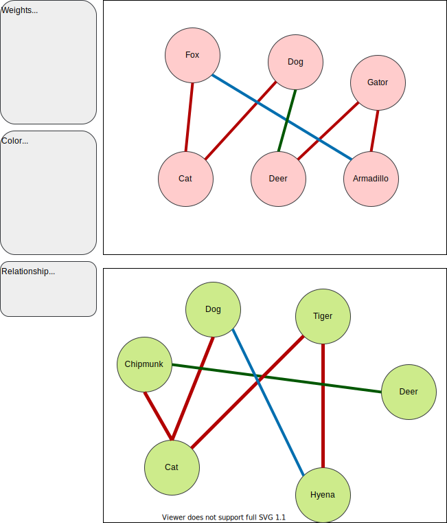

```{r Setup, message = F, include = F}
library(dplyr)
library(ggplot2)
library(igraph)
library(graphkernels)
```


# Graph Kernels
This package, from Sugiyama et. al, is available on [CRAN](https://cran.r-project.org/) and features implementations of various graph kernels for `R` or `python` (built in `C++`). For more see [here](https://github.com/Levi-Nicklas/GraphKernels/blob/master/RelevantPapers_and_Resources/R_and_Python_packages.pdf).

## Prepare Example

To learn how to use this package, I am going to construct a toy example for two reasons. First, to learn how my data needs to be formatted for this package, so that when it's time to data wrangle I am prepared. Second, to learn the functions and familiarize myself with the outputs. My toy exampl will be two graphs, six nodes each, of animals. Each node will represent an animal, with values of the animals' weights (continuous value) and the animals' colors (nominal value). The edges represent some sort of relationship between the animals (I just made this up, I have no clue how a fox responds to an armadillo), where the relationship can be _neutral_, _friendly_, or _negative_. 



One way to build the `{igraph}` object is building them from dataframe shown [here](https://igraph.org/r/doc/graph_from_data_frame.html).

```{r Build Graph Objects, echo = F}
#Build Node DF's.
A_node_df <- data.frame(name=c("Fox", "Cat", "Dog", "Deer","Gator","Armadillo"),
                     mass=c(5,3,27,70,200,4),
                     color=c("Orange", "Grey", "Black", "Brown", "Green", "Grey"))

B_node_df <- data.frame(name=c("Dog", "Tiger", "Deer", "Hyena", "Cat", "Chipmunk" ),
                     mass=c(27, 190, 70, 75, 3, 0.12),
                     color=c("Black", "Orange", "Brown", "Brown", "Grey", "Brown"))

#Build Edge DF's.
A_edge_df <- data.frame(from=c("Fox", "Fox", "Cat", "Dog", "Deer", "Gator"),
                        to=c("Cat", "Armadillo", "Dog", "Deer", "Gator", "Armadillo"),
                        interaction =c("Negative", "Neutral", "Negative", "Friendly", "Negative", "Negative"))
B_edge_df <- data.frame(from=c("Dog", "Dog", "Chipmunk", "Chipmunk", "Cat", "Tiger"),
                        to=c("Cat", "Hyena", "Deer", "Cat", "Tiger", "Hyena"),
                        interaction =c("Negative", "Neutral", "Friendly", "Negative", "Negative", "Negative"))

#Build {igraph} objects.
A <- graph_from_data_frame(d = A_edge_df, 
                           directed = F, 
                           vertices = A_node_df)

B <- graph_from_data_frame(d = B_edge_df, 
                           directed = F, 
                           vertices = B_node_df)
```

Now that the toy graph examples are built, we can plot them to see that everything matches.

```{r Graph Plot A, echo = F}
plot(A)
```

```{r Graph Plot B, echo = F}
plot(B)
```

## Package Functions
To use the package, we need to make sure the graph objects are formatted the way that package requires. First thing that needs to happen for the graphs to work in the `{graphkernels}` package, is that nodes need to be integers. In `graphkernels::GetGraphInfo()` there is an early statement in the function that coerces the node names/labels into a integer. In my toy example I made the label names character strings of the animals' names, but later in this project ID's will likely be numbers anywyas. For the toy example, I will change the factors to numbers. 

```{r}
# Refactor Animals
animal_levels <- levels(unlist(list(A_node_df$name,B_node_df$name)))
animal_levels <- data.frame(animals = animal_levels,
           id = 1:length(animal_levels))

vertex_attr(A)$name

# Recode 
vertex_attr(A)$name <- recode(vertex_attr(A)$name, "Armadillo" = 6, "Fox" = 1, "Cat" = 2, "Dog" = 3, "Deer" = 4, "Gator" = 5)
vertex_attr(B)$name <- recode(vertex_attr(B)$name, "Tiger" = 7, "Hyena" = 8, "Chipmunk" = 9, "Dog" = 3, "Cat" = 2, "Deer" = 4)

# Package wants labels to be integers?
my_graphs <- list(A,B)

my_graph_info <- graphkernels::GetGraphInfo(my_graphs[[1]])
graphkernels::GetGraphInfo(mutag[[1]])
my_graph_info
```


