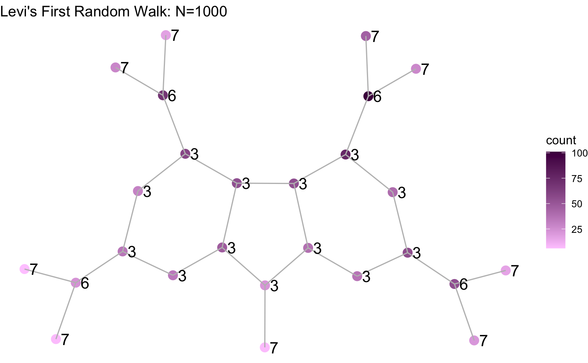

# General Notes
This notebook contains a Literature review, some notes on software, and a research journal.

## Table of Contents - Notebook
+ [Literature Review](## Literature Review)
  * [Paper 1](#paper-1-graph-kernels)
  * [Paper 2](#paper-2-graph-kernels)
  * [Paper 3](#paper-3-graph-kernels-for-social-media)
  * [Paper 4](#paper-4-similar-paper)
  * [Paper 5](#paper-5-skip-grams)
+ [Software](#software)
+ [Data](#data)
+ [Research Jorunal](#journal)

## Literature Review
### Paper 1: Graph Kernels
1. Find the paper [here](https://github.com/Levi-Nicklas/FLPoly_Thesis/blob/master/RelevantPapers_and_Resources/survey_on_graph_kernels.pdf). This is a 53 page paper covering the last 15 years of graph kernels and their applications. The authors additionally compare the performance of various kernel methods when applied for classification. For an initial skim, I think there is some good commentary on what makes the use of kernels successful and not successful. Their study on the comparison of kernel performance for a given problem may save us significant time and effort in the analysis phase.

_BibTex_ : 
```
@article{kriege2020survey,
  title={A survey on graph kernels},
  author={Kriege, Nils M and Johansson, Fredrik D and Morris, Christopher},
  journal={Applied Network Science},
  volume={5},
  number={1},
  pages={1--42},
  year={2020},
  publisher={SpringerOpen}
}
```

2. The paper gives a good review on graph notation and kernels, but suggests two other papers to reference as well. 

### Paper 2: Graph Kernels
1. Find the paper [here](https://schraudolph.org/pubs/VisSchKonBor10.pdf). This paper is a 42 page which focuses largely on the computation of graph kernels and how to compute them **efficiently**. They also have a discussion on applications.

_BibTex_ :
```
@article{vishwanathan2010graph,
  title={Graph kernels},
  author={Vishwanathan, S Vichy N and Schraudolph, Nicol N and Kondor, Risi and Borgwardt, Karsten M},
  journal={The Journal of Machine Learning Research},
  volume={11},
  pages={1201--1242},
  year={2010},
  publisher={JMLR. org}
}
```

### Paper 3: Graph Kernels for Social Media

1. Find the paper [here](https://arxiv.org/pdf/2002.00850.pdf). After reading the abstract, introduction, and related work, I have identified some other papers to look at that may be more closely related with what I would like to do. This paper, uses graph kernels in conjunction with classification algorithms to classify rumors as truthful or not. What is interesting about this paper is they use what they call a "sanitized" digraph to describe a rumor propagating through the social media. This sanitized digraph is one with all information, aside from the topology of the graph, stripped away. When all that is left is the topology, that means no linguistics are included in the classification of the rumor. I would like to focus our efforts on representing the text in a graphical manner, and then using the graph kernels on that representation of the text. So this paper is a very interesting and relevant application of graph kernels, but is not _exactly_ inline with what I would like to study.


_BibTex_ :  
```
@inproceedings{rosenfeld2020kernel,
  title={A Kernel of Truth: Determining Rumor Veracity on Twitter by Diffusion Pattern Alone},
  author={Rosenfeld, Nir and Szanto, Aron and Parkes, David C},
  booktitle={Proceedings of The Web Conference 2020},
  pages={1018--1028},
  year={2020}
}
```

### Paper 4: Similar Paper
This paper, [here](https://www.aclweb.org/anthology/D17-1202.pdf), is a paper that uses some techniques similar to the ones I propose here. The researchers are a multi-national team including reserachers from Google. I will want to cite some things they do in their paper to provide a reputiable base for what I want to do. 


_BibTex_ :
```
@inproceedings{nikolentzos2017shortest,
  title={Shortest-path graph kernels for document similarity},
  author={Nikolentzos, Giannis and Meladianos, Polykarpos and Rousseau, Fran{\c{c}}ois and Stavrakas, Yannis and Vazirgiannis, Michalis},
  booktitle={Proceedings of the 2017 Conference on Empirical Methods in Natural Language Processing},
  pages={1890--1900},
  year={2017}
}
```

### Paper 5: Skip-grams

This paper, [here](http://ira.lib.polyu.edu.hk/bitstream/10397/601/1/concgram13.pdf), is a 20 page article from a linguistics journal that outlines n-grams and various varieties of them. Amongst the varieties covers is the skip-gram; the description here matches the intuition behind my idea.

_BibTex_ :
```
@article{cheng2006n,
  title={From n-gram to skipgram to concgram},
  author={Cheng, Winnie and Greaves, Chris and Warren, Martin},
  journal={International journal of corpus linguistics},
  volume={11},
  number={4},
  pages={411--433},
  year={2006},
  publisher={John Benjamins}
}
```

## Software
- There is a package for graph kernels in R: `{graphkernels}` which depends on `{igraph}`. The package is implemented in C++ and is "very fast".
- I will use `{tidytext}` and other `{tidyverse}` packages wherever possible.

## Data
 - *Twitter*: Twitter has an API and a nice `R` package. Twitter is appealing to me because there are hundreds of interactions between users in a short amount of time. Also, users' typically have a large amount of tweets which can be treated as a corpus. My ideas here are studying user interaction networks, or measuring the similarity of two or more users (possibly politicians or someone high profile). What I do with Twitter is focus the analysis subject matter on the bipartisan nature of social media right now. This would be interesting to study where cliques may exist between users with differing political views. Alternatively, if we can use the tweets of a politician to compare their policy stances and what they view as important. This would have to be done with care, specifically to avoid any bias or favoritism in the study. I believe this can be done with a strict scientific approach. 
 
 - *reddit*: reddit has an `R` package as well, and I have worked with it in the past. A benefit of reddit is most users are anonymous, but a negative is that most users are younger men. This web forum can have long threaded discussions, longer than Twitter. This may be beneficial for a study on a very niche topic. For reddit I would also be interested in assessing communities across subreddits. I had done some early work on diet specific subreddits, and this may work here. An alternative to this may be to use reddit to examine discussion on mental health subreddits.


-------


# Journal
## Table of Contents - Journal

+ [July 2,2020](#july-2-2020)
+ [July 3,2020](#july-3-2020)
+ [July 6,2020](#july-6-2020)
+ [July 9,2020](#july-9-2020)
+ [July 28,2020](#july-28-2020)
+ [August 28,2020](#august-28-2020)
+ [September 2,2020](#september-2-2020)
+ [September 3,2020](#september-3-2020)

## July 2, 2020
Today I gathered some papers, read the abstracts, set up a Git repo for my use (and sharing with my advisor), and read some of the previous FL Poly thesis guidelines.

## July 3, 2020
Today I read some of the __Survey on Graph Kernels__ paper, reviewed data sources I am currently considering, and brainstormed a little. It is clear to me I need a better handle on the computation of kernels, so next week I will go through the mechanics of computing them. I found an R package `{graphkernels}` which appears to compute some of the kernel methods that were mentioned in the __Survey on Graph Kernels__ paper; further reading on the package is needed. It is implemented in C++ which should lead to speedy computation. 

I think this project can be a nice, whole, and complete thesis. There is opportunity to try to improve computation, try various graph kernels for comparison, study social media usage, and apply different machine learning models to the kernel. I need to further dig into the more current literature on graph kernels when I am done with the survey paper to make sure that I am working towards something novel, whether that be an application or method. 

## July 6, 2020
Today I am starting with focusing on reviewing the mathematics of the problem. I am starting with the graph kernel functions. I remember a good bit about graph mathematics from my combinatorics class, so I want to focus on kernel functions (which I never formally learned).

As I was looking for resources on graph kernels and their computation I found a lecture at a Microsoft Conference from 2016 where Vishwanathan (Author of paper: _Graph Kernels_) gives a good intro lecture to the concepts discussed in his paper. Watch the lecture [here](https://www.youtube.com/watch?v=xwVOarJGD7Q). The video quality is really bad, but the slides are available online [here](https://www.stat.purdue.edu/~vishy/talks/Graphs.pdf) to follow along and better view the mathematical notation on the slides.

Now I am going to work on the `R` code that will be used for the calculations, see the tutorial folder for `graphkernels_tutorial.rmd`.

...

Pivoting to working on data collection from Twitter.

...

Here is my rough, preliminary plan for how I will organize this project:


## July 9, 2020

Today I am spending some time to review other faculty backgrounds to see who may be a good fit for a thesis centered on applications of graph kernels to data mining.

## July 28, 2020

Haven't written in a while, had some personal anxieties going on. Anyways, this week my focus has been reviewing papers and learning the `{graphkernels}` package with toy examples. Once I learn the package a little and know more about graph kernels as a whole, and how they have been used recently, I can get a good thesis proposal together.

## August 28, 2020

Over the past two days I have been working on my thesis work again since the semester has resumed. I have focused my time more on reading papers to better understand the concepts that are critical for my thesis. I found some great papers about the computation of graph kernels and how to do so efficiently. These papers will prove useful when I get to the kernel computation phase of things. Other than reading papers, I am beginning to work on how to do the computations I will need to do. I began with a toy example in the `graphkernels_tutorial.rmd` file, but I am moving in a different direction for now. For both my personal understanding, and for greater customization, I am going to temporarily refrain from using the `{graphkernels}` package. This package is written in C++, and since I can't read C++ at that level yet, the functions are too mysterious for me to confidently write and study with them. So for now I am developing the kernel operations using `{igraph}` and `{tidyverse}` packages; these packages should be more than enough to do what I want to do. 

After some reading, I found that the graph kernels which will be simplest to explain and easiest to implement are **random walk kernels**. The two other major families of graph kernels are _subgraphs_ and _tree based_ kernels. For my project, I believe that I will have my work cut out for me with simply the random walk kernels. One downside to random walk kernels is that they are computationally expensive; random walk kernels have $O(n^3)$ or $O(m^2)$ for a graph with $n$ nodes or $m$ edges. For our case, we will need to ensure that we trim *all* excess words out of the corpus to minimize nodes and edges. In addition, at this point I would think it would be wise to keep the text sizes small... perhaps a few sentences or a paragraph at most. 

First random walk development (this morning) went good for a first try! 



## September 2, 2020

Since last time I have been working on my _big picture_ ideas and my "elevator pitch" for my thesis. In addition I revisited the slides from _Vishwanathan_, in the `RelevantPapers_and_Resources` folder. These slides are a nice concise presentation on how to compute these graph kernels. From these slides, using `{igraph}`, I will try to implement what _Vishwanathan_ outlines in the presentation. I will begin by focusing solely on the **random walk kernels**, as opposed to the **tree-based** or **subgraph** kernels; there is a sufficient amount of research to be done solely on **random walk kernels** alone.

## September 3, 2020

Today I met with Dr. Sanchez and reviewed my "elevator pitch" and the big ideas (listed in the `ThesisProposal` folder). After reviewing he recommended that I edit some small things in the "elevator pitch", that I verify the NLP community's usage of " _skip-grams_ ", and that I brainstorm some on applications of the project.

More importantly, after doing a Google Scholar search for "graph+kernels+skip+grams" there were results :sweat:. However, it is not immediately apparent that the usage of graph kernels and skip-grams is in the same fashion that I am envisioning. So this afternoon I am reviewing some of these articles.

...

**Review of skip-grams:**
Looking at the wikipedia entry for n-grams, there is a section for skip-grams (check it out [here](https://en.wikipedia.org/wiki/N-gram)). In this section, it describes precisely what I thought it did. "skip-grams[9] are a generalization of n-grams in which the components (typically words) need not be consecutive in the text under consideration, but may leave gaps that are skipped over...", and, "Formally, an n-gram is a consecutive subsequence of length n of some sequence of tokens w_1 … w_n. A k-skip-n-gram is a length-n subsequence where the components occur at distance at most k from each other. ". This description is cited from [this paper](https://www.sciencedirect.com/science/article/abs/pii/S0885230883710077?via%3Dihub). The paper is on a speech recognition system, and does not appear to be relevant to our work.


**Review of skip-grams used in coordination with graph kernels:**
Very similar paper: https://dl.acm.org/doi/pdf/10.1145/2783258.2783417 :sweat:

~~After skimming 4-5 papers' abstracts and methods sections, I still believe the idea I outlined is original enough for a thesis project. No paper appears to use graph kernels to evaluate the network formed by the skip-grams... but is used in a neural network application.~~

:rage: [This paper](https://www.aclweb.org/anthology/D17-1202.pdf) does things **very similar** to what I want to do. Does not do clustering or outlier detection.

...


