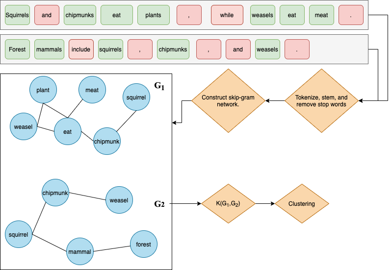

```{r setup, include=FALSE}
knitr::opts_chunk$set(echo = FALSE)
```

## About Me


<div class="columns-2">
  

    
  


 
 - B.S. Applied Mathematics (Shippensburg University of Pennsylvania).
  
 - Teaching Assistant: Pre-Calc (Ship), Applied Calculus (Ship), Intro to Data Science, Statistical Learning, Data & Text Mining, and Scientific Computing.
 
 - Other: I love cooking, I am a big basketball fan, I love hiking/backpacking.

## About Me


<div class="columns-2">
  

  - 1 **Glorious** Publication, on Text Mining Social Media (Under Dr. Sanchez-Arias, more on the way).
  
  - Internships: Industrial Engineering (Volvo Construction), Research Analyst (Security Start-Up), Data Scientist (IoT Start-Up)
  - Career: later this semester I start my career as a data scientist at the Department of Defense!

</div>

## Introduction

My proposed thesis topic, _Graph Kernels as Preprocessing for Unsupervised Text Mining Methods_, will use modern techniques on familiar data to present some novel research. The goal is to use **graph kernels** in conjunction with unsupervised methods, and to study the pairing of these methods. The data sources, **NHSTA Crash Reports** and **social media discussion on health**, will be of interest to the university.


```{r, echo=FALSE,out.width="40%",fig.cap="NHTSA SCI reports. Social Media: reddit",fig.show='hold',fig.align='center'}
knitr::include_graphics(c("./figs/nhtsa-logo.png","./figs/social-media.jpg"))
``` 


## Graph Kernels

A graph kernels is a kernel function that computes the inner product of two graphs. This allows for a **measure of similarity** between two graphs. Using this measure to compare **graph representations** of documents, provides a way to assess similarity of documents. With the measure we can also perform unsupervised methods (clustering). 

Types:

- Random Walk Kernels

- Graphlet Kernels

- Tree-Based Kernels

## Graph Representations: Skip-Grams!

<center>

</center>


## Research Questions

1. How do differing styles of text affect graph kernel methods for text mining?
<br>
<br>
2. Which clustering methods work best with the kernel methods?
<br>
<br>
3. What modifications can be made to the graph representation to improve clustering results?

## Methods

1. Compare **graph kernel** text mining methods performance on differing types of text. In this case, NHSTA reports (lengthy documents) and social media comments/threads (short documents). Computation speed/feasibility? Accuracy or other success defining metrics?

2. Use the kernel function to **evaluate distance** within in the kernel function range, which will allow for **clustering methods** to be applied (hierarchical, DBSCAN, k-means, etc). Assess **performance** accross differing methods on the same data.

3. Can we edit the graph representations to improve performance? Edit window width of the skip-grams, edit weighting on edges, and more. 

## Data Sources

Two very different data sources will be used. The NHTSA crash reports represent an example of a lengthy technical document, with a small number of samples ($N<125$). Comments and threads from social media (Twitter or reddit) represent short documents where language is often more casual, with far more samples available depending on the topic of discussion.

In addition, if time permits, a new data source may be considered to further emphasize differing performance accross documents. These data sources may include product reviews, fiction novels, news reports, etc.

## Deliverables

- Paper submitted for publication.

- Reproducible and open repository for others to build upon.

- data sets used in analysis provided in the open-source repository.

## Timeline

Describe timeline here
(using a graph/plot/figure ideally)


## References

Insert some of the references in proposal


## Questions & Comments?
| |
|:-:|
||
